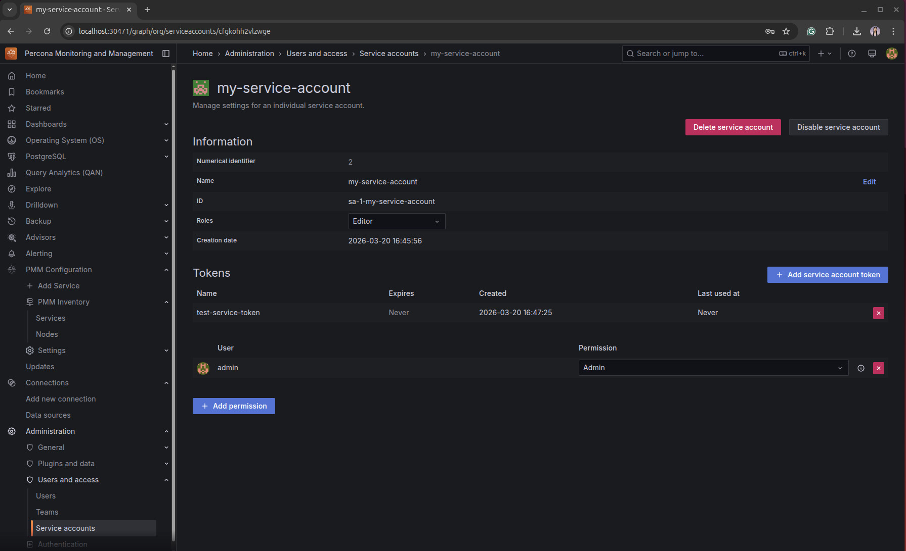

# Percona Operator + PMM: Full-Stack PostgreSQL Demo

A hands-on demo that shows the impact of Percona PostgreSQL Operator and PMM on a real application workload running on k3s, from cluster setup and database deployment to load generation, monitoring, and visibility into system behavior.

---

## Prerequisites: Deployments Overview

**`pg-deployment.yaml`**,Defines the Percona PostgreSQL cluster (`demopg`) using the Percona Operator. It provisions PostgreSQL 17 with PgBouncer for connection pooling, configures backups, and exposes the database inside the cluster. This is the main database layer that PMM will monitor.

**`loadgen-deployment.yaml`**,A multi-component load generator stack: Valkey (Redis-compatible), a web UI (NodePort 30080), dataset loader, and load generator. It simulates application traffic against PostgreSQL (and optionally MySQL/MongoDB) so you can observe real workload metrics in PMM.

---

## 1. Install k3s

```bash
sudo curl -sfL https://get.k3s.io | sh -
```

Create the kubeconfig directory and configure access:

```bash
# Create the directory if it does not exist
mkdir -p ~/.kube

# Create a config for k3s
sudo k3s kubectl config view --raw > ~/.kube/k3s-config
chmod 600 ~/.kube/k3s-config

# Use k3s for KUBECONFIG variable
export KUBECONFIG=/home/edith/.kube/k3s-config

# Test
kubectl get namespaces
```

---

## 2. Install Percona PostgreSQL Operator

```bash
kubectl create namespace demo-db
kubectl apply --server-side -f https://raw.githubusercontent.com/percona/percona-postgresql-operator/v2.8.2/deploy/bundle.yaml -n demo-db
kubectl get pods -n demo-db
```

---

## 3. Deploy the PostgreSQL Cluster

```bash
kubectl apply -f pg-deployment.yaml -n demo-db
kubectl get pods -n demo-db
```

---

## 4. Verify Database Access

Get the PgBouncer connection URI:

```bash
kubectl get secret demopg-pguser-demopg --namespace demo-db -o jsonpath='{.data.pgbouncer-uri}' | base64 --decode
```

Connect with a PostgreSQL client (replace `YOUR_PGBOUNCER_URI` with the output from the command above):

```bash
kubectl run psql-client --rm -it \
  --image=postgres:17 \
  --namespace demo-db \
  --command -- psql "YOUR_PGBOUNCER_URI"
```

Verify NodePort services:

```bash
kubectl get services -n demo-db
```

---

## 5. Deploy the Load Generator

```bash
kubectl create namespace loadgen
kubectl apply -f loadgen-deployment.yaml -n loadgen
```

Open the LoadGen web UI in your browser:

```
http://127.0.0.1:30080
```

---

## 6. Connection String

Use the output from the `kubectl get secret demopg-pguser-demopg ...` command above.

---

## 7. Install PMM (Percona Monitoring and Management)

Install PMM Server on your Kubernetes cluster using Helm and `kubectl`:

### Step 1: Create Kubernetes secret

Create a Kubernetes secret to set up the `pmm-admin` password (replace with your own password):

```bash
# Encode your password: echo -n "YOUR_SECURE_PASSWORD" | base64
cat <<EOF | kubectl create -f -
apiVersion: v1
kind: Secret
metadata:
  name: pmm-secret
  labels:
    app.kubernetes.io/name: pmm
type: Opaque
data:
  PMM_ADMIN_PASSWORD: <base64-encoded-password>
EOF
```

### Step 2: Verify the secret

Verify the secret was created and retrieve the password if needed:

```bash
kubectl get secret pmm-secret -o jsonpath='{.data.PMM_ADMIN_PASSWORD}' | base64 --decode
```

### Step 3: Add the Percona repository

Add the Percona repository and check available PMM versions:

```bash
helm repo add percona https://percona.github.io/percona-helm-charts
helm repo update
```

### Step 4: Choose PMM version

Choose your PMM version by checking available chart versions:

```bash
helm search repo percona/pmm --versions
```

### Step 5: Deploy PMM Server

Use Helm to deploy PMM Server on standard Kubernetes clusters:

```bash
helm install pmm \
  --set secret.create=false \
  --set secret.name=pmm-secret \
  --version 1.4.8 \
  percona/pmm
```

### Step 6: Verify the deployment

```bash
helm list
kubectl get pods -l app.kubernetes.io/name=pmm
```

### Step 7: Access PMM Server

Standard Kubernetes clusters provide several options for accessing PMM Server.

**Option A: Inspect the service (recommended for NodePort)**

List the service details to see which NodePort was assigned:

```bash
kubectl describe service monitoring-service
```

Look for the `NodePort` lines in the output. The PMM Helm chart typically creates a NodePort service with two ports:

- **HTTP** (port 80 → NodePort, e.g. 30471) — use this to access PMM in your browser
- **HTTPS** (port 443 → NodePort, e.g. 30967) — alternative secure access

**Why port 30471?** When the service type is `NodePort`, Kubernetes assigns a port in the range 30000–32767 on each cluster node. The exact number (e.g. 30471) is assigned at creation time and can differ per cluster. You can reach PMM at `http://<node-ip>:30471` or `http://localhost:30471` if your node is local. Use the port shown in your `kubectl describe` output.

**Option B: Port-forward (ClusterIP)**

```bash
kubectl port-forward svc/monitoring-service 8443:8443
```

Then open PMM at `https://localhost:8443`.

---

## 8. Connect PostgreSQL to PMM (pg-pmm-secret)

The `pg-pmm-secret.yaml` creates a secret with your PMM server token so the Percona Operator can register the PostgreSQL cluster with PMM for monitoring.

**Never paste your token into the repo.** Use this process:

### Generate a service account and token

PMM uses Grafana service account tokens for authentication. These tokens are randomly generated strings that serve as alternatives to API keys or basic authentication passwords.

Here's how to generate a service account token:

1. Log in to PMM.
2. From the side menu, click **Users and access** → **Service accounts**.
3. Click **Add service account**. Specify a unique name for your service account, select a role from the drop-down menu, and click **Create** to display your newly created service account.
4. Click **Add service account token**.
5. In the pop-up dialog, provide a name for the new service token, or leave the field empty to generate an automatic name.
6. Optionally, set an expiration date for the service account token. PMM cannot automatically rotate expired tokens, which means you will need to manually update the PMM-agent configuration file with a new service account token. Permanent tokens, on the other hand, remain valid indefinitely unless specifically revoked.
7. Click **Generate token**. A pop-up window will display the new token, which usually has a `glsa_` prefix.
8. Click **Copy your service token to the clipboard** and store it securely. You can now use this token for authentication in PMM API calls or in your pmm-agent configuration.



### Step 1: Store your token in a variable (one-time setup)

Create `.pmm-secrets` with your token from the step above:

```bash
echo 'export PMM_SERVER_TOKEN="your-token-here"' > .pmm-secrets
```

`.pmm-secrets` is in `.gitignore` — it will never be committed.

### Step 2: Apply the secret

`envsubst` substitutes the token from `.pmm-secrets` into the template. The result is piped to `kubectl apply` — no file with the token is ever written to disk.

```bash
source .pmm-secrets && envsubst < pg-pmm-secret.yaml | kubectl apply -f - -n demo-db
```

**Summary:** Token lives only in `.pmm-secrets` → `envsubst` substitutes it → `kubectl` applies. No token is ever committed.
